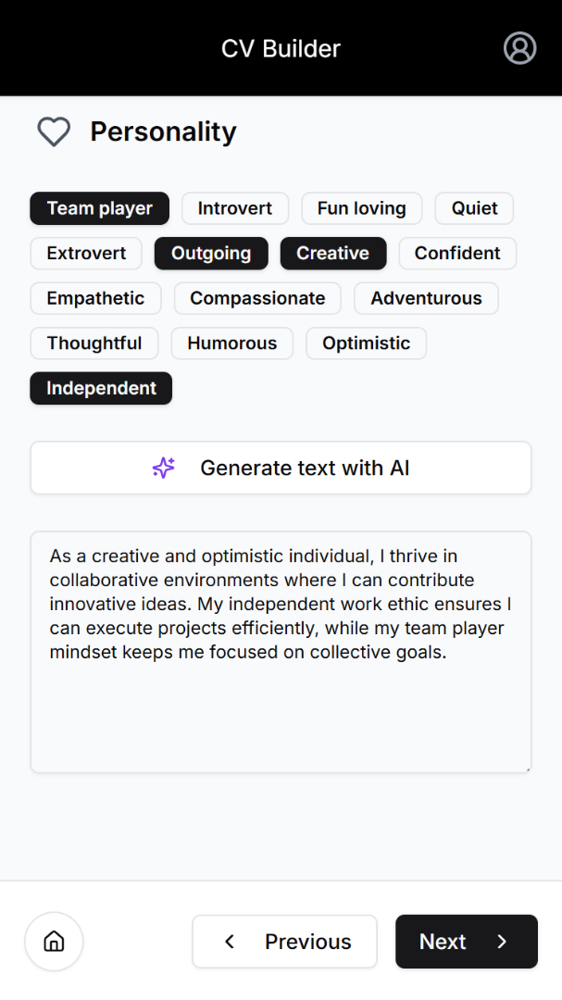
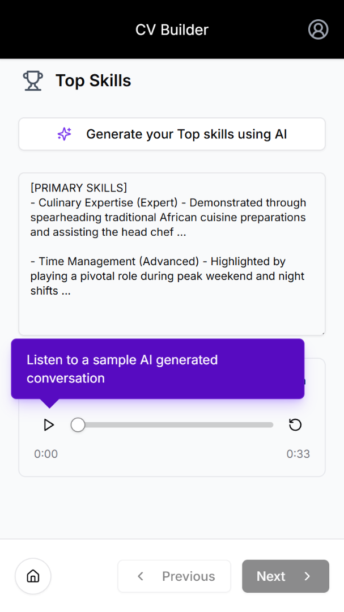

# CV Builder 🧠

> AI-assisted CV generator — answer guided prompts, get a polished, professional CV.

**Live at [cvbuilder.co.za](https://cvbuilder.co.za)**

---

## Overview

CV Builder takes the blank-page problem out of writing a CV. Users work through a guided set of prompts about their experience, skills, and goals - and the app uses AI to generate clear, well-structured content tailored to them. The result is a professional CV they can download and use immediately.

Built as a full-stack personal project using Next.js on the frontend and a serverless AWS backend.

---

## Screenshots





---

## Features

- 🤖 **AI-assisted content generation** — prompts guide users through their experience; AI writes the copy
- 📄 **Downloadable CV output** — clean, formatted document ready to send
- ⚡ **Fast, serverless backend** — AWS Lambda handles AI calls with low latency
- 🎨 **Clean, minimal UI** — built with Tailwind CSS for a distraction-free experience
- 🔄 **State management via RTK Query** — efficient data fetching and caching

---

## Tech Stack

| Layer                 | Technology                        |
| --------------------- | --------------------------------- |
| Frontend              | Next.js · React · TypeScript      |
| Styling               | Tailwind CSS                      |
| State / Data fetching | RTK Query                         |
| Backend               | AWS Lambda · API Gateway          |
| AI                    | Anthropic / OpenAI API            |
| Deployment            | Vercel (frontend) · AWS (backend) |

---

## Architecture

```
User browser
    │
    ▼
Next.js (Vercel)
    │  RTK Query
    ▼
AWS API Gateway
    │
    ▼
AWS Lambda
    │  AI API call
    ▼
LLM (generates CV content)
    │
    ▼
Response streamed back to UI
```

---

## Getting Started

### Prerequisites

- Node.js 18+
- AWS account with Lambda + API Gateway configured
- An API key for your chosen LLM provider (Anthropic or OpenAI)

### Installation

```bash
# Clone the repo
git clone https://github.com/rishadomar/cv-builder.git
cd cv-builder

# Install dependencies
npm install

# Set up environment variables
cp .env.example .env.local
```

### Environment Variables

Create a `.env.local` file in the root:

```env
NEXT_PUBLIC_API_URL=https://your-api-gateway-url.amazonaws.com
```

On the Lambda side, set:

```env
LLM_API_KEY=your_api_key_here
```

### Run locally

```bash
npm run dev
```

Open [http://localhost:3000](http://localhost:3000)

---

## Deployment

**Frontend** — deployed to Vercel. Connect your GitHub repo and Vercel handles the rest.

**Backend** — deploy Lambda functions via AWS Console or the AWS CLI:

```bash
zip -r function.zip .
aws lambda update-function-code \
  --function-name cv-builder \
  --zip-file fileb://function.zip
```

---

## Roadmap

- [ ] Multiple CV templates / styles
- [ ] Job description import — tailor CV to a specific role
- [ ] LinkedIn profile import
- [ ] PDF export with custom styling
- [ ] Save and edit past CVs

---

## About

Built by [Rishad Omar](https://linkedin.com/in/rishad-omar) — senior full-stack developer based in Cape Town, South Africa.

Other projects: [PIL — Patient Information Leaflet Reader](https://github.com/rishadomar/pil) · [Savvy Website Builder](https://savvy.site)

---

## License

MIT
